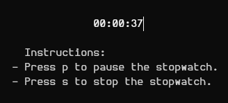
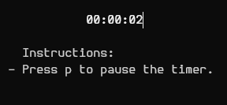
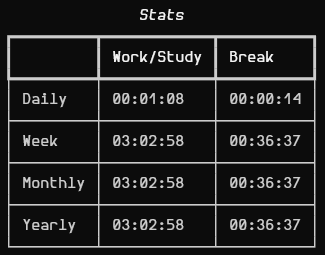

# Fomodoro #
Stopwatch and timer to work or study with Flowtime technique from your terminal.

**Stopwatch**:

**Timer**:

**Fomodoro-stats**:

## Installation ##
`pip install fomodoro`

## Use ##
1. Execute `fomodoro` to start the stopwatch, you can press **p** to pause or **s** to stop it.
2. Execute `fomodoro` **a second time** to start the timer, you can press **p** to pause it.
> [!IMPORTANT]
> To execute the timer you need to stop the stopwatch, to do it you need to press **s** when the stopwatch is executing.
3. Execute `fomodoro-stats` to get your stopwatch and timer stats.
